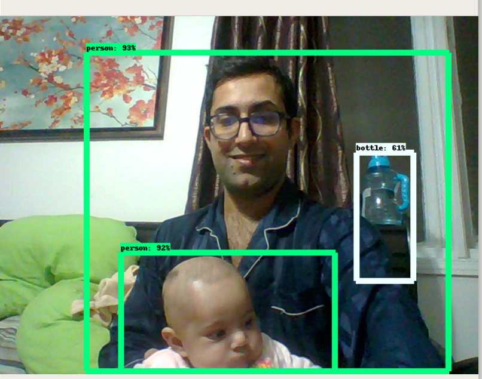
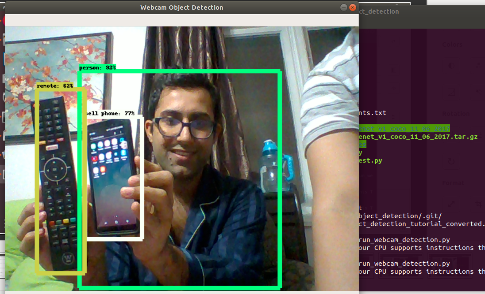

## Tensorflow Object Detection API with Webcam

* Install dependencies from requirements.txt
* run file run_webcam_detection.py
* application will take some time with no prompt while loading.
* application will load download and load ssd_mobilenet on first run.
* press "Q" to quit the application.

### Demo Screenshots

